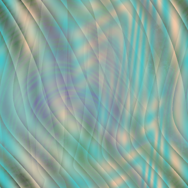
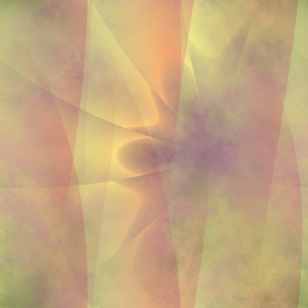

# StarfishJS
A JavaScript port of my friend [Mars Saxman](http://redecho.org/)'s C program [Starfish][] to generate beautiful, tiled, procedurally-generated background images. [Try out the web version here!](http://micah.cowan.name/starfishjs/)

  [starfish]: https://packages.debian.org/stable/xstarfish

StarfishJS (like its C predecesor) is Free/Libre Software, and is licensed under the [GNU GPL](LICENSE.txt) (version 3 or later).

## Samples ##



If you want a little peak under the hood, you can see the individual image-generating algorithms at play: the generators currently available are [Coswave][], [Spinflake][], [Rangefrac][], [Flatwave][], and [Bubble][].

  [coswave]: http://micah.cowan.name/starfishjs/#!test=Coswave
  [spinflake]: http://micah.cowan.name/starfishjs/#!test=Spinflake
  [rangefrac]:  http://micah.cowan.name/starfishjs/#!test=Rangefrac
  [flatwave]:  http://micah.cowan.name/starfishjs/#!test=Flatwave
  [bubble]:  http://micah.cowan.name/starfishjs/#!test=Bubble

The image generators all operate in monochrome values, and translated into color later. Some of the generated images aren’t displayed directly, but instead are used to hide/reveal pixels of other layers.

## Installation

### Web interface

Installing the web interface for StarfishJS is as simple as:

```
$ git clone https://github.com/micahcowan/starfishjs.git
```

Then just point your web browser at the included `index.html` file, and
you're good to go!

### Command-line tool

The best way to install the command-line tool, is to use **npm**.
First, install [NodeJS](https://nodejs.org/), then run

```
$ npm install -g starfishjs
```

to install the command (which is named **starfish**). (You might need to
run the command via **sudo**, depending on how your NodeJS installation
is set up.

## Command-Line Invocation

```
Options:
  --help, -h       Show help                                           [boolean]
  --output, -o     Path of the image file to create
                                                [string] [default: "output.png"]
  --size, -s       Proportions of the output image [string] [default: "384x384"]
  --verbose, -v    Display progress                   [boolean] [default: false]
  --version, -V    Show version number                                 [boolean]
  --wallpaper, -w  [EXPERIMENTAL] Set the finished image as the desktop
                   background                         [boolean] [default: false]

Examples:
  starfish.js -v -s 720x720          (Or just -s 720.) The -v option is
                                     recommended for interactive use in a
                                     command console.
  starfish.js -o ~/wallpaper.png -w  Generate a wallpaper at ~/wallpaper.png,
                                     and set it as the current desktop
                                     wallpaper. Currently, there are a number of
                                     known issues with this feature, including
                                     that it can't set tiled mode (so it'll be
                                     either centered or stretched - ugly if it's
                                     much smaller than the desktop); and doesn't
                                     set all desktop backgrounds, only the
                                     current one.

```
